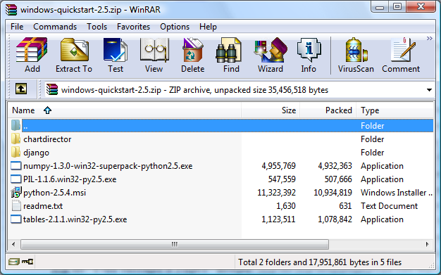
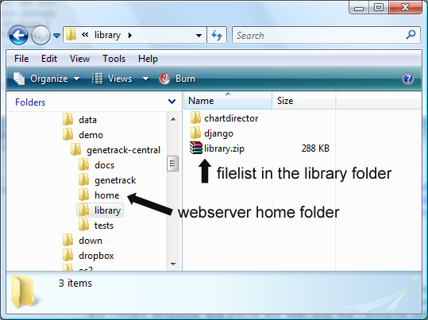

GeneTrack Installation
======================

GeneTrack works on **Windows**, **Linux** and **Mac OS X** operating systems. It requires 
**Python** and several Python extension libraries. Most required libraries are
open source but the plotting library used during visualization requires a License.
GeneTrack has been designed to have *low* system requirements. It will run well even
on a low end laptop.

System requirements
-------------------

The actual system requirements depend on the amount of data (number of rows), the 
genome size and
the number of simultanous analysis processes that are allowed to run. General rules:

* each dataset of **10 million** of reads will need approximately **300 MB** of hard drive space. 
* the server instance has relatively low memory requirement of around **100 MB** or less.
* when executing simultanouse processes the overall memory usage will will add up
* in general having **1 GB** free memory will allow for a simultanous processing of multiple datasets for 
  the largest genomes (such as of human).
* once the data is uploaded GeneTrack will index it for speedy access. This 
  transformation takes with a performance of approximately **2 minutes** for 
  each **1 million** data rows.

GeneTrack will run on any operating system for which the required python package and modules 
are available, such as Microsoft Windows 2000, XP, Vista, and Mac OS X 10 or later, 
and all Linux distributions: Red Hat Linux, SUSE, Ubuntu etc. 
Please see the software requirements below for further information. In general we recommend
that Mac and Linux users to use **package managers**, like ``rpm``, ``apt-get``, ``yum``, ``MacPorts``
to install the dependecies rather than installing them from sources (see you operating system
for details).

GeneTrack is designed to operate as a web-based application that will present 
its user interface through any modern web browser such as Firefox 2.5 or later, 
Safari 4.0, and Microsoft Internet Explorer 7.0 or later.

Installation
------------

This section describes a basic installation of GeneTrack as a stand-alone deployment 
on a single server. We offer details for a quick installation for Windows and 
detailed instructions for all other platform. See bottom of the page for :ref:`os-x-tips`.

Quick install for Windows
^^^^^^^^^^^^^^^^^^^^^^^^^

This section describes a quick installation for Windows users. 
As a convenience Windows users may download 
:download:`windows-quickstart-2.5.zip <static/windows-quickstart-2.5.zip>` (35 MB) 
file that contains all the required libraries and files including **Python**:

List of files in ``windows-quickstart-2.5.zip``:

- readme.txt 		(General readme file)
- python-2.5.4.msi 	(Python 2.5 for x86 processors)
- numpy-1.3.0-win32-superpack-python2.5.exe 	(for Python 2.5)
- tables-2.1.1.win32-py2.5.exe 			(for Python 2.5)
- PIL-1.1.6.win32-py2.5.exe			(for Python 2.5)
- Django-1.1-django_folder.zip	(including only the django folder of Django v1.1)
- ChartDirector-5.0-lib_folder.zip 	(including only the lib folder of ChartDirector v5.0 for Python)

then install them according to the following instructions:

#. Download and unzip the **GeneTrack** system
#. Download :download:`windows-quickstart-2.5.zip <static/windows-quickstart-2.5.zip>`
#. Unzip the file into a separate directory (extract all)
#. Install Python 2.5 with ``python-2.5.4.msi``.
#. Install NumPy v1.3.0 with ``numpy-1.3.0-win32-superpack-python2.5.exe``.
#. Install PyTable v2.1.1 with ``tables-2.1.1.win32-py2.5.exe``.
#. Install the Python Imaging Library with ``tables-2.1.1.win32-py2.5.exe``.
#. Move the ``django`` folder into the ``library`` folder of Genetrack
#. Move the ``chartdirector`` folder into the ``library`` folder of Genetrack

When you finish the quick installation, the final directory for GeneTrack will  
be organized in the following way.

Once installation is complete you can move to the `Running Genetrack <running.html>`_ page.

Unix installation
^^^^^^^^^^^^^^^^^

This section provides a full description for installation of the GeneTrack software. 
Users may choose a specific version for software requirements for their own system. 
It is important that the version of all software packages must be compatible with each other. 
Mac and Linux users should use a software **package manager** to ensure that
all dependecies are properly installed.  

#. Install the `Python <http://www.python.org/>`_ programming language of version **2.5** or higher.
#. Install `Numpy <http://numpy.scipy.org/>`_. 
#. Install `PyTables <http://www.pytables.org/>`_.
#. Install the `Python Imaging Library <http://www.pythonware.com/products/pil/>`_. 
#. Install `django <http://www.djangoproject.com/>`_ 
#. Download and install `ChartDirector <http://www.advsofteng.com/>`_. and place the modules
   into your python path. By default the ``library`` folder of GeneTrack will be considered a 
   python import location.

For Unix type systems you will also need to unpack the content of
this :download:`fonts.tar.gz <static/fonts.tar.gz>` file in place it into the same
directory that chartdirector has been accessed from (for example ``library`` if 
you followed the instructions above)

When compiled separately you may need to add the ``HDF`` to the library load path like so ::

    export LD_LIBRARY_PATH=$LD_LIBRARY_PATH:/home/ialbert/usr/hdf5

Once installation is complete you can move to the `Running Genetrack <running.html>`_ page

.. _os-x-tips:

Mac OSX tips
^^^^^^^^^^^^

**GeneTrack** runs well on OSX. Set up is not complicated
but somewhat tedious as several steps need to be followed in order and 
familiarity with basic system administration may be necessary:

  1. Install `XCode <http://developer.apple.com/tools/xcode/index.html>`_ on your Mac. 
     These are developer tools created by Apple you will need to register (free).

  2. Install `Macports <http://www.macports.org/>`_
  
  3. The following is using ``Macports`` to install binaries. From
     a terminal install ``python2.6``, ``numpy``, ``setuptools`` like so::
        
        $ sudo port install python26
        $ sudo port install py26-setuptools
        $ sudo port install py26-numpy
           
  4. Install ``hdf`` then ``pytables`` and the latter will ask us to 
     specify the location of the location of the HDF libraries. For that we need to write::
     
        $ sudo port install hdf5-18
        $ export HDF5_DIR=/opt/local
        $ easy_install-2.6 tables
  
  5. install django and bx-python::
  
        $ easy_install django

Once installation is complete you can move to the `Running Genetrack <running.html>`_ page.